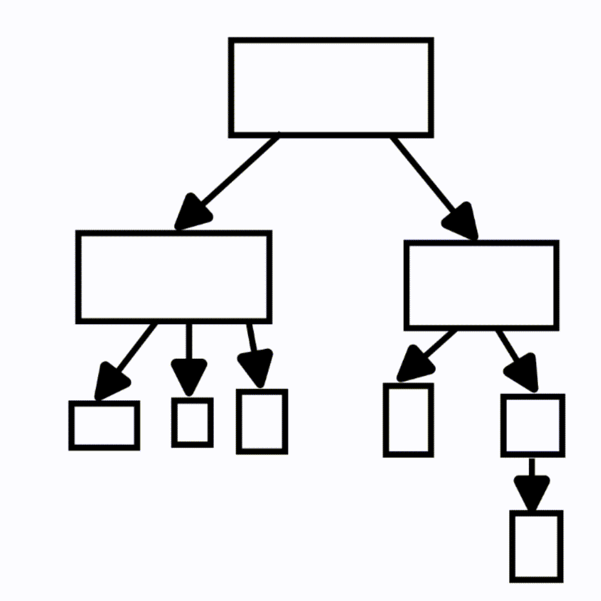

# Explanation of flow design:

I tried my best to stick to the model of the JSON provided, so my algorithm is thus. 

1. Compile a list of tasks indexed by name
2. Examine the relationships between the tasks
	- If a task should run on success of another task add it to that task's on-success list
	- If a task should run on failure of another task add it to that task's on-failure list
3. Execute the first task
4. If successful sequentially execute every task on the first task's on-success list. Otherwise sequentially execute every task on the first task's on-failure list
5. Repeat recursively until you run out of tasks. If the same task is encountered twice, skip it and its lists of dependencies. This is to prevent a fork bomb

